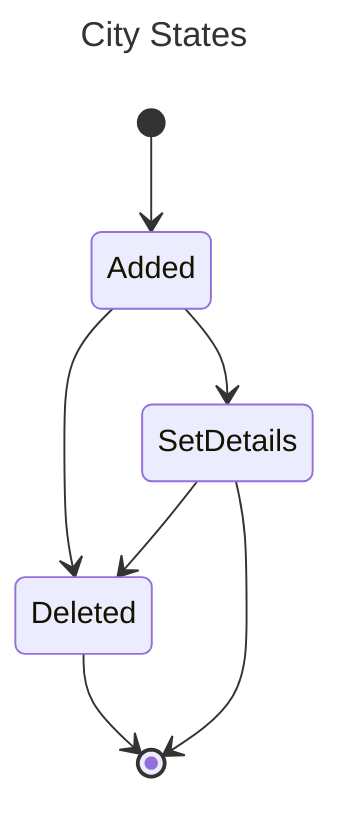

# City Map App
City Map App is a single-page TypeScript React app that allows users to add cities to a list and display them on a map. It provides functionality to add and delete cities and fetches additional city details using a third-party API.

The app uses a store provided via the <CityProvider /> component, which facilitates state transactions for the city list. The state transitions are as follows:

Transitioning to the `SetDetails` state is managed via a side effect when adding a city to the store. The side effect triggers a lookup via the API Ninja API to collect metadata in the form of `CityDetails`, which includes the longitude and latitude of the city. To optimize performance, requests are effectively debounced by:
* First verifying that the city exists in the store and that CityDetails are missing.
* Disabling the submit button while a request is in progress.
* Leveraging the `useEffect` hook to run the `useStoreSideEffect` hook only when there are modifications to the inputted city value or the store.

Transitioning to the `Deleted` state is managed by either user input from within the `<List />` component or in the event of an error when fetching `CityDetails` from the third-party API.
Simple error handling is implemented to display any errors back to the user during the input process. In the event of an error, the store is cleaned up to remove the invalid city entry.

The `useValidCities` hook is provided to allow components such as `<List />` and `<Map />` to retrieve a list of valid cities from the store that have completed `CityDetails` with longitude and latitude information.

## Usage
To use the City Map App, follow these steps:
1. Clone the repository: `git clone https://github.com/edelauna/planworth-app.git`
2. Install dependencies: `npm install`
3. Start the development server: `npm start`
4. Open the app in your browser: http://localhost:3000

# Current Considerations
The existing City Map App has some limitations and areas for improvement. Here are the current considerations:

## From a User Perspective:
* Missing Authentication: The app currently lacks authentication functionality. Adding an `<UserProvider />` component can provide user authentication and authorization context.
* Missing Authorization: Currently, the API key for api-ninjas is hardcoded.
* Missing Persistence: The app does not have durable persistence in terms of data storage.
* Improved UI/UX: Enhancements can be made to the user interface and experience. This includes improving fuzzy searches and implementing better error handling to provide a smoother and more user-friendly experience.

## From a Developer Perspective:
* Lack of Tests: The app currently does not have any tests. Implementing tests, such as unit tests and integration tests, can ensure code reliability and prevent regressions.
* Limited Linting: Adding linting tools, such as ESLint, can enforce code quality and maintain consistent code style across the application.
* Missing Contribution Guidelines: Providing contribution guidelines can help onboard new contributors and establish a clear process for submitting code changes.
* No CI/CD: Implementing a Continuous Integration/Continuous Deployment pipeline can automate the build, test, and deployment processes, leading to faster and more efficient development.
* Monitoring: Incorporating monitoring tools can help track app performance, identify bottlenecks, and proactively address issues.
* Logging / Error Handling: Implementing a logging and error handling system can assist in debugging and provide insights into any potential issues or error scenarios.
* Feature Flags: Adding feature flag functionality can enable the app to have toggles for enabling/disabling certain features, allowing for easy experimentation and deployment of new functionality.

# Future Recommendations
To continue improving the City Map App, here are some future recommendations:

## To Improve User Experience:
* Implement OAuth 2.0 Authentication: Adding an OAuth 2.0 authentication endpoint can ensure secure user logins and allow for data to be associated with individual users through access and refresh tokens. Integration with a trusted third-party authentication provider can provide the necessary expertise for best practices and a seamless user experience.
* Persist Data Across Devices: Saving the data into a database would allow users to access their saved cities across devices. In the event of large datasets, they can be managed by using techniques such as streaming or pagination to serve the data in appropriate chunks to the user.
* Standardized Component Library: As the app grows and more components are added, it can be beneficial to create a standardized component library. This library would include commonly used components (e.g., `<Button />`) to ensure brand consistency and improve the UI/UX across the application.

## To Improve Developer Experience:
* Add Testing Framework: Implement a testing framework, such as React Testing Library or Storybook, to enable test-driven development and ensure the reliability and quality of the codebase.
* Implement ESLint Rules: Set up ESLint with appropriate rules to enforce code quality and maintain consistent code styles across the project.
* Developer Contribution Guidelines: Create contribution guidelines to help new developers onboard to the stack and establish clear processes for submitting code changes and collaborating on the project.
* Set Up CI/CD Pipeline: Look into CI/CD pipeline providers, such as GitHub Actions, to automate processes such as testing, linting, packaging, and deployments. This streamlines the development workflow and ensures faster, more efficient development cycles.
* Implement Analytics: Set up an analytics system to track user interactions, business metrics, and other key performance indicators. Recording user sessions using screen recording or session replay capabilities can provide valuable insights into app usage patterns.
* Set Up Logging and Error Handling: Implement a centralized logging and error handling system to collect logs and error messages during regular app usage. This enables proactively identifying and resolving issues and helps improve the stability and reliability of the application.
* Implement Feature Flags: Introduce feature flags to gate or meter rollouts of new features to specific audience segments or users. This allows for controlled testing and validation before launching features to the general audience.

# Impacts / Risks
## Authentication
The main concern with implementing authentication is ensuring safety and proper access controls. As the app scales, the biggest consideration would be setting up appropriate load balancers to ensure traffic is routed to healthy nodes that can efficiently process authentication requests. Regular load balancing tests can help determine the necessary infrastructure for handling bursts of traffic.

## Database
Persisting data within a database introduces read and write I/O limitations. As the app scales, it's important to consider the increased demand for reading data compared to writing data. Depending on the chosen database technology, implementing read replica database servers can help handle increased read requests. To manage write requests, vertical scaling of the existing database server by adding more compute resources can be considered. Additionally, implementing data partitioning for less
frequently accessed data or exploring horizontal scaling by distributing the workload across multiple database servers can help handle write requests efficiently.

### Large Data Sets
As the app grows and users continue to add more data to the database, a concern arises regarding the amount of bandwidth the app utilizes. One potential solution is to consider alternative data formats, such as Avro, instead of JSON to reduce network bandwidth requirements. In additional to localStorage there's also the possibility to leverage IndexedDB provided in the browser to filter or compute a larger subset of data. This can improve the app's performance and scalability when operating with large data sets.

## UI/UX
### Design System:
As the app continues to grow, implementing a Design System can be beneficial. A Design System provides a standardized set of components, styles, and guidelines for developers to reference and implement. This helps establish consistency in design and user experience as new features are added to the app.

### Bundle Size (Time to First Byte):
To optimize the app's performance, logically grouping commonly used components into their respective packages can improve the bundling process. Performing regular tree shaking to evaluate large dependencies on third-party packages can also help reduce the bundle size and improve loading times.

## Testing
As the app grows in complexity, ensuring that new code does not introduce bugs, becomes a high priority. Implementing comprehensive testing strategies can help achieve this.

### Visual Inspection Tests:
Using a tool like Storybook for visual inspection tests can help developers review component renderings and ensure consistency across the app. Pairing it with Chromatic can allow for saving snapshots of rendered components, making it easier to identify any visual regressions. Storybook can also be augmented with automated accessibility (a11y) testing, as well as interaction testing when paired with tools like Mock Service Worker. Prioritizing Jest tests for utility functions and data converters can help minimize the burden of writing redundant tests for components.

#### Caching Strategy:
As the test suite expands, implementing a proper caching strategy can help optimize testing processes. This ensures that only new changes are tested and prevents the entire test suite from running each time. Providing developers with proper IDE settings to run isolated tests locally allows for faster test execution without affecting developer velocity.

### Integration Testing:
Identifying and prioritizing integration tests for happy paths can be valuable. These tests should be run after each deployment as smoke tests to ensure overall functionality is maintained. Tools like Cypress or Selenium can be used for integration testing across different devices. Coordination with third parties and backend service maintainers is necessary to establish appropriate test accounts and test data.

### Environments:
Updating the bundling process to support different environments, such as development and staging, is important to test features at various stages of the software development lifecycle.

## Developer Experience
### Linting Concerns
As an app scales to a large-scale application, linting concerns can arise. Some considerations include:
* Consistency: Establishing and enforcing consistent code styles across the codebase becomes more important. Adopting eslint rules and configuring them to match the project's code style can help maintain code consistency.
* Performance: As the codebase grows, linting can become slower, especially if it processes all files on each linting run. Separating the codebase into smaller, logical modules/packages and performing linting on changed files or relevant modules can help improve linting performance.

### Contribution Guideline Concerns:
When scaling to a large app, contribution guideline concerns may include:
* Onboarding: As more developers join the project, providing clear and detailed onboarding documentation becomes crucial. This includes setting up the development environment, code conventions, testing guidelines, and project structure.
* Code Review Process: Establishing a code review process and guidelines helps maintain code quality and consistency across the larger team. Clearly defining expectations for code reviews, including the use of linting, testing, and documentation, can streamline the review process.
* Collaboration: Encouraging effective collaboration within the development team requires documenting and communicating project requirements, design decisions, and ongoing discussions.

### Continuous Integration & Continuous Deployment:
Implementing a CI/CD pipeline is essential for a large app. Using tools like GitHub Actions for CI and an external container registry with Kubernetes for CD allows for automated builds, tests, and deployments. Might consider using a cache repository like AWS S3 to improve build times if GitHub Actions cache is not large enough.

### Monitoring, Alerts, Logging, and Error Handling:
For ease of this readme, probably go with Sentry to get it all in once place, but depending on the business case I'm sure there's suitable alternatives in this space. Key considerations as a company scales would be ease of use and integration with React. I personally like screen recordings for front end troubleshooting to get a sense of how the app is being interacted with, or any janky UI things.

Something to be mindful of when setting up monitoring, and logs, is to ensure that no PII data can be accidentally leaked or exfiltrated.

### Feature Flags:
Implementing feature flags becomes important as the app grows to allow for gradual feature rollouts, A/B testing, and experimentation. Leveraging a feature flag provider like LaunchDarkly can facilitate controlled feature rollout, monitoring, and gradual improvements.
